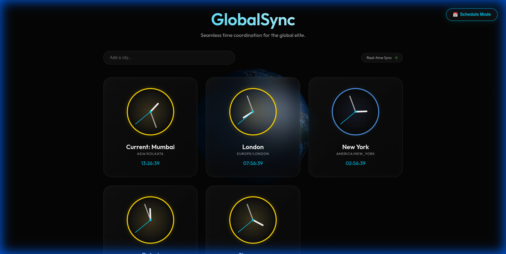
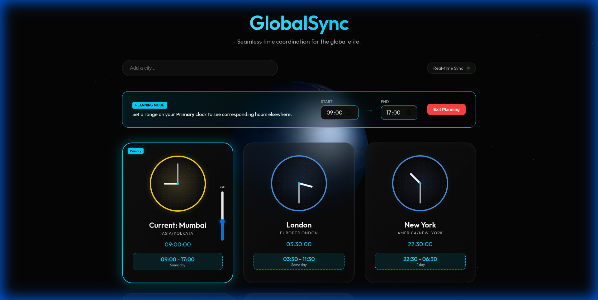

# 🌍 GlobalSync | Premium World Clock & Meeting Planner

**GlobalSync** is a high-end, interactive world clock designed for global entrepreneurs, digital nomads, and elite teams. It transcends the basic "clock" by offering a tactile, 3D-interactive experience for coordinating life and business across the globe.

---

## 💎 Why I Created This
Managing a global team means constant mental math. "If it's 2 PM for me, is my developer in Singapore sleeping or just starting their day?" 

I built **GlobalSync** to replace mental fatigue with visual intuition. I wanted a tool that feels like a premium cockpit for a global business—where you can "scrub" through time and see the world react in real-time.

---

## ✨ Elite Features

### 📅 Tactical Planning Mode (AB Testing)
Pause real-time sync and enter a "Planning State." Set a **Primary Clock** (usually your own) and use the **Vertical 24H Slider** or **Direct Hand Interaction** to sweep through the day. Every other clock on the dashboard will instantly calculate its corresponding time range.

### 🌅 Day/Night Visual Awareness
No more accidental midnight calls. Every clock face glows based on local sunlight:
- ☀️ **Golden Glow**: Active working hours (6 AM - 6 PM).
- 🌙 **Deep Blue**: Quiet/Night hours (6 PM - 6 AM).

### 📍 Auto-Geolocation
The app uses IP-based geolocation to instantly detect your city and sets it as the **Primary** reference point the moment you land on the page.

### 🪐 3D Earth Environment
A fully interactive, rotating 3D Earth sits in the background, providing a cinematic sense of scale to your global operations.

### 🔄 Drag-and-Drop Organization
Reorder your clocks based on priority. Keep your most active client or your core development team at the top-left for instant visibility.

---

## 🚀 One-Minute Quick Start

1. **Visit** [earthclock.pages.dev](https://earthclock.pages.dev).
2. **Add Cities**: Use the search bar for any major global hub.
3. **Plan**: Click "Schedule Mode" at the top right.
4. **Scrub Time**: Drag the vertical slider next to your Primary clock to see how your schedule aligns globally.

---

## 🛠️ Built With

- **Three.js**: Rotating 3D Earth & Star-field.
- **Vanilla Javascript**: Core time-engine & custom sync logic.
- **Glassmorphism CSS**: Premium dark theme aesthetics.
- **ipapi.co**: Seamless user location detection.

---

*Built for those who live locally but think globally.* 🌎✨
